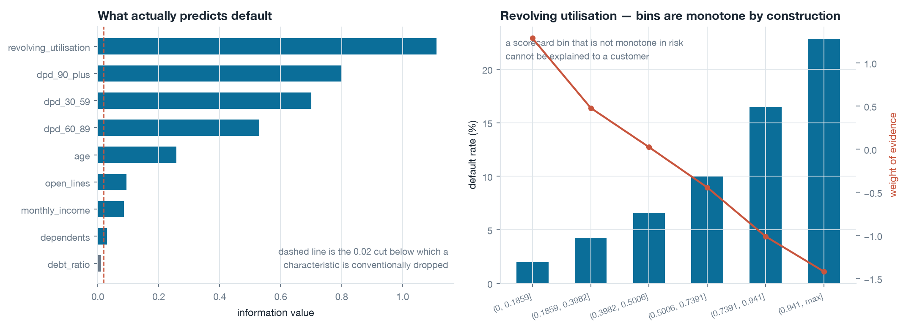
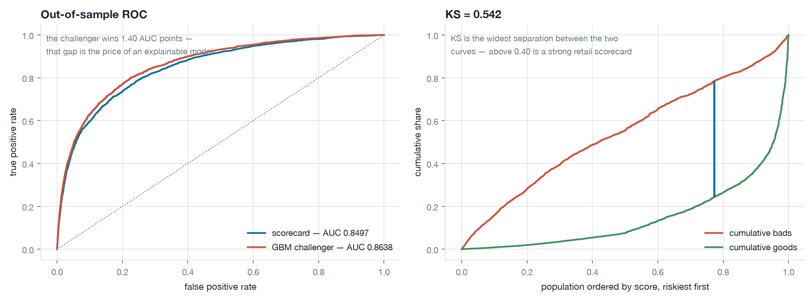
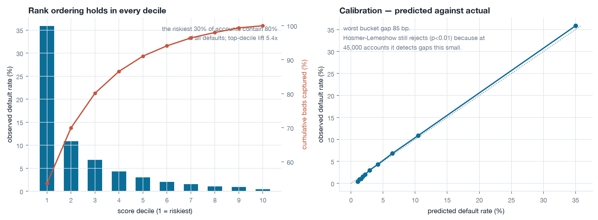
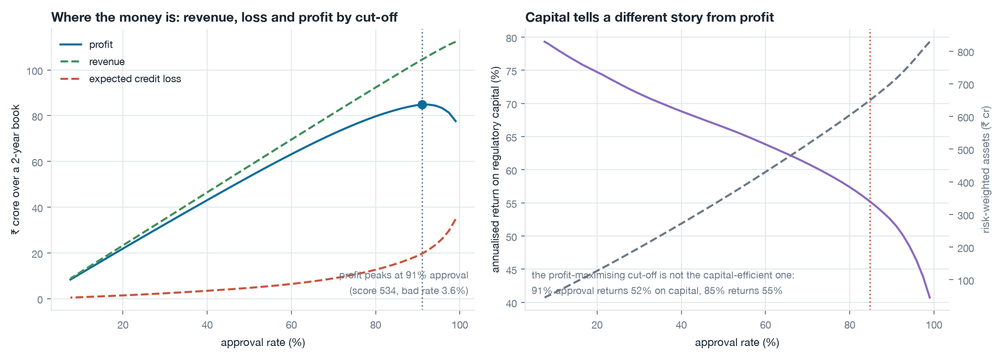
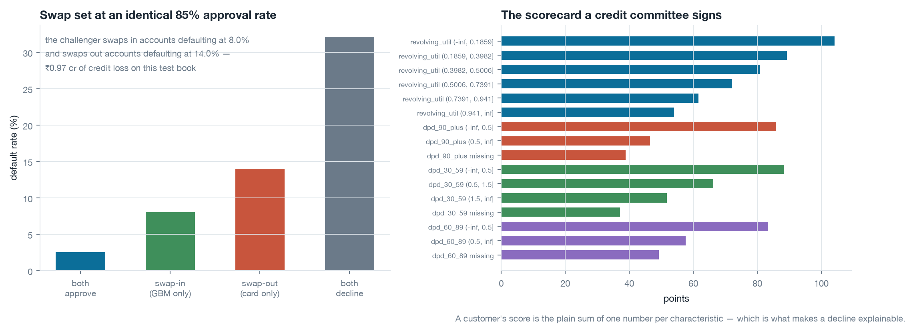

# PD Scorecard & Lending Policy Engine

A complete retail credit-risk build on 150,000 real borrower records: data-quality
forensics, monotonic weight-of-evidence binning, an auditable points scorecard, full
validation, a gradient-boosting challenger, and — the part most scorecard projects stop
short of — **the cut-off decision**, priced in expected credit loss, profit, Basel IRB
risk-weighted assets and return on regulatory capital.

```bash
uv venv --python 3.12 .venv && source .venv/bin/activate
uv pip install -r requirements.txt
curl -L https://openml.org/data/v1/download/22125240/GiveMeSomeCredit.arff \
     -o data/raw/GiveMeSomeCredit.arff
python scripts/run_pipeline.py    # figures, scorecard.csv, results.json
pytest -q                          # 28 tests
```

**Data.** Give Me Some Credit (Kaggle, 2011; mirrored on OpenML) — 150,000 accounts, a
two-year serious-delinquency outcome, **6.68% bad rate**. It is the standard public stand-in
for an unsecured retail book.

---

## Headline

| | scorecard | GBM challenger |
|---|---|---|
| test AUC | **0.8497** | 0.8638 |
| Gini | **0.699** | 0.728 |
| KS | **0.542** | 0.574 |
| rank-ordering breaks across 10 deciles | **0** | — |
| explainable to a customer | **yes** | no |

The riskiest 30% of the book contains **80% of all defaults**; top-decile lift is **5.4x**.
Against a naive approve-everyone policy, the recommended cut-off lifts two-year profit on a
₹900 crore test book from ₹73.8 cr to **₹82.5 cr** while cutting risk-weighted assets by
**₹188 cr**.

---

## 1. The data is not clean, and the cleaning is the model

Four repairs, each of which changes the answer, all logged to `reports/data_quality_audit.csv`:

| issue | rows | what was done |
|---|---|---|
| Delinquency counters holding **96 / 98** | 269 each | These are bureau codes for *no history*, not "96 times 30 days late". Left in, they become the most predictive thing in the file and the model learns to detect a missing-data flag instead of credit risk. Set to missing and given their own WOE bin. |
| `DebtRatio` above 10 | 28,877 (19%) | **93% of these rows have no monthly income.** On an income-missing row the field is not a ratio at all — it holds a monthly rupee amount. Flagged as a separate population rather than merged. |
| `MonthlyIncome` missing | 29,731 (20%) | Kept missing. The missingness is itself predictive (WOE +0.19), so imputing it destroys signal and hides a real underwriting fact. |
| `age = 0` | 1 | Dropped. |

And one thing deliberately *not* done: **no winsorising**, despite utilisation values above
50,000. Both the scorecard's binning and the gradient-boosting challenger are rank-based —
an outlier lands in the top bin either way, and capping only destroys the ordering inside
it. Capping is a fix for models that read the magnitude; this pipeline has none.

---

## 2. Binning and information value



| characteristic | IV | reading |
|---|---|---|
| revolving utilisation | 1.11 | very strong |
| 90+ days past due | 0.80 | very strong |
| 30-59 days past due | 0.70 | very strong |
| 60-89 days past due | 0.53 | very strong |
| age | 0.26 | medium |
| open credit lines | 0.09 | weak |
| monthly income | 0.09 | weak |
| dependents, debt ratio, real-estate lines | ≤0.03 | dropped |

Two engineering notes that materially changed the result:

**Counters need a different binner.** A decision tree with a 5%-of-population leaf
constraint cannot split a variable where 95% of accounts sit on zero — it returns one bin
and an information value of exactly 0.00, which reads as "no signal" when the truth is
"the split you need is at zero versus one or more". Binning counters on their own distinct
values took `dpd_60_89` from **IV 0.00 to IV 0.53**.

**Monotonic merging has to target the violation.** Merging the adjacent pair with the
*closest* event rates — the obvious rule — keeps collapsing perfectly good splits; it walked
`monthly_income` down to two bins and IV 0.006. Merging the pair that violates monotonicity
*worst* restores five bins and IV 0.086.

---

## 3. The scorecard

Logistic regression on WOE, scaled the standard way: 600 points means 50:1 odds, and every
20 points doubles the odds. The full points table is in `reports/scorecard.csv` and every
characteristic contributes between 37 and 104 points.

| characteristic | coefficient on WOE |
|---|---|
| revolving utilisation | −0.643 |
| 30-59 DPD | −0.532 |
| 90+ DPD | −0.511 |
| age | −0.400 |
| monthly income | −0.385 |
| 60-89 DPD | −0.384 |
| dependents | −0.289 |

Every coefficient is negative, which is what it must be — high WOE means low risk. That was
not true on the first fit: **`open_lines` came out positive**, meaning it was fighting the
other characteristics rather than adding to them (it correlates with `real_estate_lines` and
with age). A positive coefficient in a scorecard is not a curiosity, it is a decline reason
that points the wrong way, and it fails review. Dropping it cost **0.0001 AUC** — 0.8496 to
0.8497. Interpretability was free.

`Scorecard.explain()` returns the per-characteristic points for any applicant, which is the
adverse-action reason code, and the components sum exactly to the score (tested).

---

## 4. Validation




Four separate questions, because a model can pass one and fail the others:

**Discrimination** — test AUC 0.8497, Gini 0.699, KS 0.542. Train-to-test decay is 0.003
AUC, so there is no meaningful overfitting to worry about.

**Rank ordering** — zero inversions across ten deciles: 35.9% default in decile 1, 0.4% in
decile 10. A model with a respectable AUC that inverts in the middle deciles cannot carry a
cut-off at all, and AUC will never tell you.

**Calibration** — worst decile gap 85 bp, most under 50 bp. Hosmer-Lemeshow nonetheless
rejects at p < 0.01, and that is worth being precise about rather than quietly omitting:
the HL chi-square scales linearly with sample size, so at 45,000 accounts it detects gaps
this small. The test is answering "is the miscalibration statistically detectable" when the
question that matters is "is it economically material". At 85 bp on a 6.7% base rate, it is
not — but if the book were priced off these probabilities, the top bucket's +87 bp would be
a real under-provision and would need a calibration layer.

**Stability** — PSI 0.0001 between train and test (stable, as it should be for a random
split), and 0.028 against the below-median-income segment. The honest limitation: this
dataset has **no time dimension**, so a genuine out-of-time PSI cannot be computed. The
segment PSI demonstrates the mechanic; it is not a substitute for the real test, and in
production the out-of-time run is the one that matters.

---

## 5. The cut-off — where a scorecard becomes a decision

A scorecard makes no money. A cut-off does, and choosing one is economics, not statistics.
Assumptions: ₹2,00,000 exposure per account, 65% LGD, 16% APR against a 7% cost of funds and
2.5% servicing, over a two-year behavioural life. A defaulting account earns roughly half
its margin before it charges off — ignoring that flatters every aggressive cut-off.



| policy | approval | bad rate | ECL (₹ cr) | profit (₹ cr) | RWA (₹ cr) | return on capital |
|---|---|---|---|---|---|---|
| approve everyone | 100% | 6.68% | 39.2 | 73.8 | 838 | 38.3% |
| profit-maximising (score ≥ 534) | 91.0% | 3.61% | 19.7 | **84.9** | 716 | 51.5% |
| risk appetite ≤3% bad rate (score ≥ 550) | 84.8% | 2.90% | 15.2 | 82.5 | **650** | **55.2%** |

**The two optima are not the same cut-off, and that is the finding.** Maximising profit says
approve 91%. Maximising return on regulatory capital says approve less — the last 6% of
approvals adds ₹2.4 cr of profit but consumes ₹66 cr of extra risk-weighted assets, a
marginal return well below what the capital could earn elsewhere. A credit policy written on
profit alone systematically over-lends, and the reason is buried in the Basel IRB formula:
the asset correlation *falls* as PD rises, so risk weight is a convex function of PD and the
marginal account at the cut-off is far more capital-hungry than the portfolio average.

---

## 6. What the challenger is actually worth



The GBM wins 1.4 AUC points. AUC does not tell you what that is worth, so both models are
cut at the **same 84.8% approval rate** and compared on who changes hands:

| segment | accounts | default rate |
|---|---|---|
| approved by both | 36,902 | 2.53% |
| **swap-in** — GBM approves, scorecard declines | 1,248 | **8.01%** |
| **swap-out** — scorecard approves, GBM declines | 1,248 | **14.02%** |
| declined by both | 5,602 | 32.13% |

The challenger swaps out accounts defaulting at 14.0% and swaps in accounts defaulting at
8.0% — **₹0.97 crore of credit loss avoided on this test book alone**, at zero cost in
volume. That is the real price of insisting on an explainable model, and it is a number a
credit committee can weigh against the regulatory and operational cost of deploying a
black box.

The defensible answer in an Indian retail context is usually a **hybrid**: ship the
scorecard as the decisioning model, run the GBM in shadow, and use the swap set as the
standing evidence for whether the gap has grown enough to justify the change.

---

## What this does not claim

- **No time dimension.** The dataset is a single cross-section, so out-of-time validation,
  a real PSI, and vintage analysis are all impossible. Those are the three things that
  actually kill scorecards in production.
- **No reject inference.** These are booked accounts only. A live application scorecard is
  fitted on approvals but deployed on *applicants*, and the through-the-door population is
  systematically different. Ignoring that biases the cut-off optimistically. Doing it
  properly needs the reject population, which no public dataset carries.
- **The economics are indicative, not ICICI's.** EAD, LGD, yield and funding cost are
  plausible unsecured-retail assumptions in `config.py`, chosen to make the *shape* of the
  trade-off right. Every number in section 5 moves with them; the ranking of policies does not.
- **PD is a two-year probability**, matching the target's outcome window, not the one-year
  PD that Basel formally requires. The IRB capital numbers are therefore comparative rather
  than regulatory.
- **The bad definition is given, not chosen.** In a real build, deciding what counts as a
  "bad" — and the roll-rate analysis that sets the outcome window — is a larger and more
  consequential piece of work than the model.

---

## Repository layout

```
src/pdse/
  data.py        loading, the four repairs above, audit log, stratified split
  binning.py     monotonic WOE binning, discrete-counter handling, information value
  scorecard.py   logistic on WOE, points scaling, per-characteristic explanation, GBM challenger
  validation.py  AUC/Gini/KS, decile rank ordering, calibration, Hosmer-Lemeshow, PSI
  policy.py      account economics, the cut-off curve, constrained optimum, swap-set analysis
  capital.py     Basel IRB retail correlation, capital requirement, RWA and return on capital
scripts/         run_pipeline.py — the whole build end to end
tests/           28 tests
reports/         figures, scorecard.csv, decile_table.csv, cutoff_curve.csv, results.json
```

## Tests

`pytest -q` — 28 tests, checking properties rather than stored outputs: that WOE equals the
log odds-ratio of its bin in closed form, that information value is never negative, that a
counter which is 95% zeros still gets split, that missing values receive their own WOE, that
the score scale really doubles the odds every 20 points, that per-characteristic points sum
exactly to the total, that PSI is ~0 against an identical population and >0.25 against a
shifted one, that IRB correlation falls as PD rises and stays inside [0.03, 0.16], that
tightening the cut-off monotonically lowers the approved bad rate, and that a swap set
partitions the population exactly.

## Licence

MIT.
